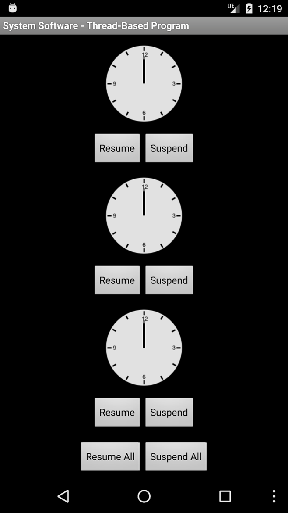

# Multithreading in Android: A Clock App

Two applications - each displaying three clocks with buttons to start and stop them. One is written with synchronization and multithreading techniques.

### Problem Description

_Write a Java application[^1] that displays three clocks in a group, with control buttons to start and stop all of them. Then, rewrite the application by applying threading concept to control the clock animation. Run the applications. Compare the two applications with and without synchronization to see its effect._

### Solution Sample

{ width="200px" }

## Getting Started

After cloning the repository, you may run the programs using **Android Studio** along with an emulator (AVD) or an actual device for testing purposes.

## Contributing

Pull requests are welcome. For major changes, please open an issue first to discuss what you would like to change.

## References

* **CodingInFlow** - *Major resource* - [Threading - Android Programming](https://www.youtube.com/playlist?list=PLrnPJCHvNZuD52mtV8NvazNYIyIVPVZRa)
* **Thorsten Schreiber** - [Android Binder Interprocess Communication](https://docplayer.net/18424655-Android-binder-android-interprocess-communication-thorsten-schreiber-first-advisor-juraj-somorovsky-second-advisor-daniel-bussmeyer.html)

## Acknowledgments

* Hat tip to anyone whose code was used

<!-- Footnotes formatted by GitHub to appear here -->

[^1]: **Fun Fact** - The requirement for this project was in pure Java, but I leveraged my Android programming skills to come up with a unique solution.
