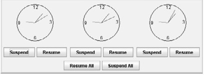

# Multithreading in Android: A Clock App

Two applications - each displaying three clocks with buttons to start and stop them. One is written with synchronization and multithreading techniques.

### Problem Description

_Write a Java application[^1] that displays three clocks in a group, with control buttons to start and stop all of them. Then, rewrite the application by applying threading concept to control the clock animation. Run the applications. Compare the two applications with and without synchronization to see its effect._

### Solution Sample

### Managing Multiple Threads with the Binder IPC

Here, the regular version of the clock app (left) generates two Binder Threads basically in coordination for the UI thread and the background thread only. In the threaded and synchronized version (right), it creates three binder threads. The other threads shown are default and mandatory process threads for the operating system to maintain. But how exactly do Binder Threads work?

Binder thread is used in Android Service Binding with Interprocess Communication (IPC). Most of the time you will encounter this concept in Service calls with interfaces defined by Android Interface Definition Language (AIDL).

In the AIDL case, Service calls are executed by threads maintained by a default Thread Pool created with your application. Those threads are called Binder Threads. This grants the Service the ability to work on multiple calls happening at the same time.

Here's a breakdown of binder threads' influence when multithreading on the Android platform as seen in the synchronized clock app:

- A default binder thread for the UI (main) thread and other visual related components is generated.

- A second default binder thread for the app and its related background threads is generated.

- A third binder thread (which can be more) the operating system creates for the program upon realizing the program contains multiple calls for operations to be done on distinct threads.

- Rather than creating extra threads (as the source code would suggest), the Android operating system generates a Binder which acts as a background service that replicates multiple multithreading requests.

- So that when a new thread request is made from the program, the Android operating system detects the call and check for a pre-existing thread that is bound to a similarly executing process.

- Then it takes the information or command intended to be carried out from the new thread request and passes it to the binder thread using an Handler object (a core Android wrapper for the Java Thread class). 

- At this stage, a thread would normally terminate after completion and as such a **message queuing** mechanism is employed to mitigate this.

- Upon receiving the command message, the Handler object attaches a **Looper** to the message queue that executes the existing thread command (or messages) in an infinite loop that keeps the thread alive unless an explicit kill command is specified – essentially recycling the existing thread and preventing resource wastage (which is precisely why the Android operating system provided only one additional “super” binder thread despite the multithreaded clock program making at least six multithreading requests!)[^2].

Important information on Handlers, Loopers, Message Queue, and binder threads (in contexts related to/exceeding the scope of this research) as discussed above - can be found in the works of Thorsten Schreiber, on YouTube by Florian Walther (_CodingInFlow_), and the official Android documentation by Google.

## Getting Started

After cloning the repository, you may run the programs using **Android Studio** along with an emulator (AVD) or an actual device for testing purposes.

## Contributing

Pull requests are welcome. For major changes, please open an issue first to discuss what you would like to change.

## References

* **CodingInFlow** - *Major resource* - [Threading - Android Programming](https://www.youtube.com/playlist?list=PLrnPJCHvNZuD52mtV8NvazNYIyIVPVZRa)
* **Thorsten Schreiber** - [Android Binder Interprocess Communication](https://docplayer.net/18424655-Android-binder-android-interprocess-communication-thorsten-schreiber-first-advisor-juraj-somorovsky-second-advisor-daniel-bussmeyer.html)

## Acknowledgments

* Hat tip to anyone whose code was used

<!-- Footnotes formatted by GitHub to appear here -->

[^1]: **Fun Fact** - The requirement for this project was in pure Java, but I leveraged my Android programming skills to come up with a unique solution.
[^2]: See the synchronized version of [`ChronometerActivity.java`](SystemSoftwareThreaded/app/src/main/java/com/iumw/widget/ChronometerActivity.java).
